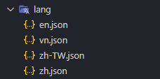

# Angularjs 多語系 練習

> 此為測試使用 angular.js 多語系使用 https://github.com/cadmusgo/lab-angularjs.translate

## 系統設定

1. library 設定
```html
<!-- 引入 angular-translate -->
<script src="https://cdnjs.cloudflare.com/ajax/libs/angular-translate/2.9.2/angular-translate.min.js"></script>
<script src="https://cdnjs.cloudflare.com/ajax/libs/angular-translate/2.9.2/angular-translate-loader-static-files/angular-translate-loader-static-files.min.js"></script>
```
2. angular.js 設定
```javascript
var app = angular
			// pascalprecht.translate 引入
			.module('app', ['pascalprecht.translate'])
			.controller('myController', ['$scope', '$translate',
				function ($scope, $translate) {
                }])
			.config(function ($translateProvider) {
				// 读取本地JSON文件，prefix代表文件路径前缀，suffix代表文件后续
				$translateProvider.useStaticFilesLoader({
					prefix: './lang/',
					suffix: '.json'
				});
				// 设置默认的语言
				$translateProvider.preferredLanguage('zh');
			});;                    
                    
```

3. 語系檔案設定

   1. 在專案目錄中新增 `lang` 目錄

   2. 目錄中增加對應語系 json 檔案

      


# 使用方式

HTML 頁面

1. 一般使用

    ```html
    <!-- name 是json 語系中的 key  -->
    <p>{{"name"|translate}}</p>
    ```

2. 語系中帶參數

   

   html

   ```html
   // 方式1 直接注入參數
   <p>{{ 'sayName' | translate:'{ userName: "听风是风" }' }}</p>
   
   // 方式2 變數以 javascript 變數寫入
   <p translate="sayName" translate-values='vm.userName'></p>
   ```
   
   javascript

   ```javascript
   vm.userName = {
       userName: '听风是风'
   };
	```

   json 語系檔

   ```JSON
	// en.json
   {
       "sayName":"my nam is {{userName}}"
   }
   // zh.json
   {
       "sayName":"我的名字是{{userName}}"
   }
   ```


javascript 中

1. 一般使用
    ```javascript

    _self.alert = function () {
        // sayName 是語系中的key
        let msg = $translate.instant('sayName');
        alert(msg);
    };
    ```

2. 語系帶參數

    ```javascript

    _self.alert = function () {
        let msg = $translate.instant('sayName', {
            userName: 'echo'
        });
        alert(msg);
    };
    ```


## script 方式載入js檔案

> 考量 jQuery 等其他其端共用語系js 檔案，故將 json 改以 javascript 方式載入


## 參考文章

- [angularjs国际化多语言，angular-translate教程详解](https://www.cnblogs.com/echolun/p/12762839.html)


